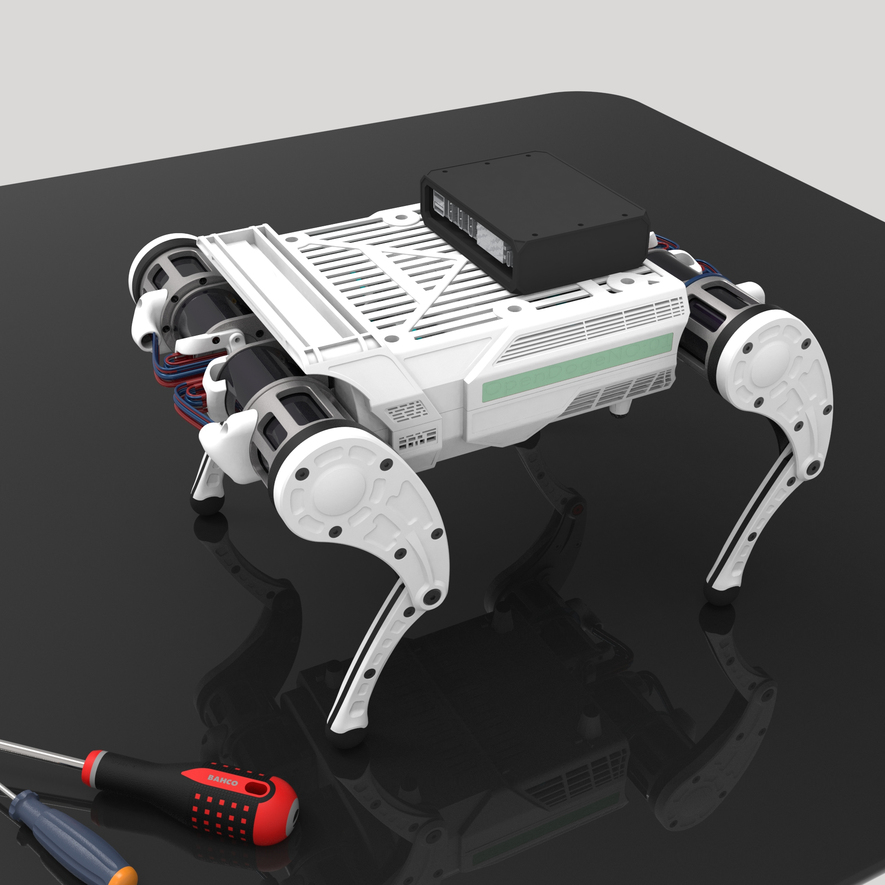

# OpenDoge

OpenDoge 是一款开源的小型四足机器人项目，涵盖从机械结构设计、URDF 仿真描述、嵌入式固件控制到强化学习训练与实机部署的全栈开发。目标是打造一套低成本、可复现、端到端的四足机器人开发方案。



## 仓库结构

```
OpenDoge/
├── OpenDoge_hardware/       # 机械结构设计 & 器件规格书
├── OpenDoge_description/    # URDF/Xacro 机器人描述文件 (ROS/ROS2)
├── OpenDoge_firmware/       # 独立 C++ 实机部署 & Python 工具链
├── OpenDoge_train/          # Isaac Gym 强化学习训练框架 (衍生自 HIMLoco)
├── OpenDoge_deploy/         # MuJoCo Sim2Sim 验证 & 策略迁移
└── OpenDoge_origin/         # 主仓库（本仓库）— 文档与项目总览
```

## 各模块说明

### [OpenDoge_hardware](https://github.com/OpenDogeRobotics/OpenDoge_hardware)

机械结构设计与元器件资料。

```
OpenDoge_hardware/
├── mechanical/
│   ├── V1.0/                           # 当前发布版本
│   │   ├── OpenDog/                    # 405 个 SolidWorks 零件文件 (.SLDPRT)
│   │   ├── 全零件.STEP                  # 整机零件级装配体 (~80 MB)
│   │   └── 全子装配.STEP                # 子装配层级 STEP (~82 MB)
│   └── V2.0/                           # 下一迭代版本（开发中）
└── datasheets/                         # 器件规格书 & 配套资料
    ├── dm-imu/                         # DM-IMU-L1 六轴 IMU 说明书、固件、例程
    ├── chiwu/                          # 尺物电机驱动板原理图 & 控制例程
    └── EL05使用说明书2600428.pdf         # EL05 电机使用说明书
```

**设计要点：**
- 12 自由度四足构型：4 条腿 × 3 个驱动关节（hip / thigh / calf）
- 所有机械零件使用 SolidWorks 设计，STEP 文件兼容 Fusion 360、FreeCAD
- 结构件适配 3D 打印（PLA/PETG/尼龙）与 CNC 铝合金加工
- 足端建议使用橡胶或 TPU 材料以增加抓地力

### [OpenDoge_description](https://github.com/OpenDogeRobotics/OpenDoge_description)

ROS/ROS2 机器人描述包，提供运动学、动力学模型与可视化网格。

```
OpenDoge_description/
└── URDF/
    ├── urdf/
    │   ├── Opendoge.urdf              # 完整 URDF 运动学与动力学模型
    │   └── Opendoge.csv               # 关节/连杆映射表
    ├── meshes/                        # 各连杆 STL 网格（机身 + 4 条腿 × 4 段）
    │   ├── base_link.STL
    │   ├── FL_{hip,thigh,calf,foot}.STL   # 左前腿
    │   ├── FR_{hip,thigh,calf,foot}.STL   # 右前腿
    │   ├── RL_{hip,thigh,calf,foot}.STL   # 左后腿
    │   └── RR_{hip,thigh,calf,foot}.STL   # 右后腿
    ├── config/joint_names_Opendoge.yaml
    ├── launch/
    │   ├── display.launch             # RViz 可视化启动
    │   └── gazebo.launch              # Gazebo 仿真启动
    ├── xml/
    │   ├── Opendoge.xml               # MuJoCo MJCF 模型
    │   └── scene.xml
    ├── CMakeLists.txt
    └── package.xml
```

**关节映射表（12 个驱动关节）：**

| 腿 | Hip | Thigh | Calf | Foot（固定） |
|-----|-----|-------|------|-------------|
| FL（左前） | FL_hip_joint | FL_thigh_joint | FL_calf_joint | FL_foot |
| FR（右前） | FR_hip_joint | FR_thigh_joint | FR_calf_joint | FR_foot |
| RL（左后） | RL_hip_joint | RL_thigh_joint | RL_calf_joint | RL_foot |
| RR（右后） | RR_hip_joint | RR_thigh_joint | RR_calf_joint | RR_foot |

**依赖：** ROS/ROS2、`robot_state_publisher`、`joint_state_publisher`、`rviz`、`gazebo`。  
**许可证：** BSD。

### [OpenDoge_firmware](https://github.com/OpenDogeRobotics/OpenDoge_firmware)

独立 C++ 实机部署程序，搭配 Python 工具链。**运行时无 ROS 依赖** — 主部署二进制 `opendoge_deploy` 直接管理 CPU ONNX 推理、4 路 SocketCAN、EL05 电机运控帧与安全阻尼。

```
OpenDoge_firmware/
├── src/
│   └── opendoge_deploy/               # 非 ROS 实机部署主程序 (C++)
│       ├── src/
│       │   ├── main.cpp               # 入口：状态机、控制循环
│       │   ├── el05_socketcan.cpp      # EL05/RobStride CAN 协议驱动
│       │   ├── onnx_policy.cpp         # ONNX Runtime 策略推理后端
│       │   ├── policy.cpp              # 策略后端抽象（ONNX / linear_csv / none）
│       │   └── runtime_io.cpp         # 命令文件 & IMU 文件 I/O
│       └── include/opendoge_deploy/    # 头文件（类型、策略、CAN、I/O）
├── scripts/
│   ├── setup_can.sh                   # 初始化 4 路 SocketCAN 接口
│   ├── setup_vcan.sh                  # 虚拟 CAN（无硬件测试用）
│   ├── setup_onnx.sh                  # 本地下载安装 ONNX Runtime
│   └── start_robot.sh                 # 一键聚合启动：CAN + IMU + 手柄 + deploy
├── tools/
│   ├── el05/                          # EL05 电机交互测试菜单 & 协议自检
│   ├── imu/dm_imu_bridge.py           # DM-IMU-L1 串口 → 状态文件桥接守护进程
│   ├── joystick/                      # Xbox 手柄 → 命令文件桥接守护进程
│   └── usb2can/                       # USB2CAN 示例 & 电机演示脚本
├── policy/                            # 部署用 ONNX 策略模型
├── Changelog/Codex.md                 # 开发变更日志
├── docs/                              # 参考文档
└── requirements.txt
```

**部署链路：**

```text
opendoge_deploy（单进程）
  → CPU ONNX 策略推理 @ 100 Hz
  → 位置目标保持 @ 200 Hz
  → EL05 q/dq/tau/kp/kd 控制 @ 1000 Hz
  → SocketCAN can0/can1/can2/can3
  → USB 转 4 路 CAN2.0 模块
  → 12× EL05/RobStride 电机
```

**电机 CAN 映射：**每条 CAN 总线驱动一条腿（3 个电机）：

```text
can0: 左前 FL, 电机 1/2/3  = hip/thigh/calf
can1: 右前 FR, 电机 4/5/6  = hip/thigh/calf
can2: 左后 RL, 电机 7/8/9  = hip/thigh/calf
can3: 右后 RR, 电机 10/11/12 = hip/thigh/calf
```

**核心特性：**
- **多策略后端：** ONNX Runtime (CPU)、linear CSV、none（纯阻尼模式）
- **安全优先设计：** 电机故障、过温、反馈超时、CAN 异常、急停触发时自动进入阻尼模式
- **实时性支持：** 可选 `SCHED_FIFO` + `mlockall` 低延迟控制
- **灵活 I/O：** 命令输入通过文件（兼容手柄桥接），IMU 输入通过串口桥接 — 无需 ROS topic
- **Dry-run 模式：** 无硬件全链路验证（vCAN 或无 CAN 模式）

### [OpenDoge_train](https://github.com/OpenDogeRobotics/OpenDoge_train)

基于 Isaac Gym 的强化学习训练框架，衍生自 [HIMLoco](https://github.com/InternRobotics/HIMLoco)。

```
OpenDoge_train/
├── legged_gym/                        # 核心训练框架
│   ├── envs/
│   │   ├── base/                      # 基础类 (LeggedRobot, LeggedRobotCfg)
│   │   ├── opendoge/                  # OpenDoge 训练配置 & 任务注册
│   │   ├── a1/ go1/                   # Unitree A1 / Go1 配置
│   │   └── go2/ g1/ h1/ h1_2/ zsl1/   # 更多机器人配置
│   ├── scripts/
│   │   ├── train.py                   # 训练入口
│   │   └── play.py                    # 演示 & ONNX 导出
│   ├── utils/                         # 工具（task_registry, logger, terrain 等）
│   └── sim2sim.py                     # MuJoCo Sim2Sim 验证入口
├── rsl_rl/                            # HIMLoco PPO 实现（fork 自 RSL-RL）
│   └── rsl_rl/
│       ├── algorithms/                # HIMPPO, PPO
│       ├── modules/                   # HIMActorCritic (LSTM), HIMEstimator
│       ├── runners/                   # HIMOnPolicyRunner
│       └── storage/                   # HIMRolloutStorage
├── deploy/
│   ├── deploy_mujoco/                 # MuJoCo Sim2Sim 脚本 & 配置
│   ├── deploy_real/                   # 实机部署（Unitree Go2/G1/H1）
│   └── pre_train/                     # 预训练模型权重
├── resources/robots/Opendoge/         # OpenDoge URDF + MuJoCo XML + STL 网格
├── Tool/
│   ├── check_urdf.py                  # URDF 验证工具
│   └── simplify_mesh.py               # 网格减面工具
├── scripts/export_onnx.py             # 独立 ONNX 导出脚本
├── onnx/                              # 导出的 ONNX 策略模型
├── docs/                              # 训练调参记录
├── setup.py
├── himloco.yml                        # Conda 环境配置
└── setup_env.sh                       # 环境安装辅助脚本
```

**快速启动（训练）：**
```bash
# 环境准备
conda create -n himloco python=3.8
conda activate himloco
pip install torch==2.3.1 torchvision==0.18.1 --index-url https://download.pytorch.org/whl/cu121
pip install mujoco==3.2.3
# 从 NVIDIA 官网下载安装 Isaac Gym Preview 4
pip install -e <isaacgym_path>/isaacgym/python
pip install -e .

# 训练 OpenDoge
export PYTHONPATH=$PWD
python legged_gym/scripts/train.py --task=opendoge --headless --num_envs=4096

# 从 checkpoint 继续训练
python legged_gym/scripts/train.py --task=opendoge --resume --load_run <run_name> --checkpoint <N>
```

**演示 & 导出：**
```bash
python legged_gym/scripts/play.py --task=opendoge --load_run <run_name>
# ONNX 模型保存至 onnx/ 目录
```

**核心特性：**
- **课程学习：** 从站立逐步过渡到动态行走的渐进式训练
- **域随机化：** 摩擦力、电机力矩系数、负载、外力扰动、PD 参数随机化
- **RNN 策略：** 基于 LSTM 的 Actor-Critic 架构，具备步态记忆能力
- **多机器人支持：** OpenDoge、Unitree A1/Go1/Go2、H1/H1_2、G1、ZSL1
- **Sim2Sim 导出：** MuJoCo XML + ONNX 策略用于部署前验证
- **TensorBoard 监控：** 所有奖励分项的全量标量日志

### [OpenDoge_deploy](https://github.com/OpenDogeRobotics/OpenDoge_deploy)

基于 MuJoCo 的 Sim2Sim 策略验证与部署。

```
OpenDoge_deploy/
├── deploy/
│   └── deploy_mujoco/
│       ├── deploy_opendoge.py          # 键盘控制 Sim2Sim
│       ├── deploy_opendoge_xbox.py     # Xbox 手柄控制 Sim2Sim
│       ├── onnx_path_utils.py          # ONNX 模型路径解析
│       └── configs/opendoge.yaml       # 部署配置（PD 增益、观测缩放等）
├── mujoco/                             # 传统控制方法（IK、位置控制）
│   ├── opendoge_mujoco/                # IK 求解器、IMU 反馈、步态控制器
│   ├── scripts/                        # 键盘 IK 控制、位置控制演示
│   └── configs/
├── onnx/                               # ONNX 策略模型
│   ├── flat_opendoge_9000_omni.onnx    # 全向策略，9000 轮（推荐）
│   ├── flat_opendoge_fresh_6000.onnx   # Fresh 策略，6000 轮
│   ├── flat_opendoge_5700.onnx         # Gen4 风格策略，5700 轮
│   └── flat_opendoge_gen52_4800.onnx   # Gen52 策略，4800 轮
└── resources/robots/Opendoge/          # MJCF 模型 + STL 网格
```

**快速启动：**
```bash
conda activate himloco
# 键盘控制
python deploy/deploy_mujoco/deploy_opendoge.py
# Xbox 手柄控制
python deploy/deploy_mujoco/deploy_opendoge_xbox.py
# 指定 ONNX 模型
python deploy/deploy_mujoco/deploy_opendoge.py --onnx onnx/flat_opendoge_9000_omni.onnx
```

**PD 参数对齐（部署 ↔ 训练）：**

| 参数 | 部署值 | 训练值 |
|------|--------|--------|
| kp | 12.0 | 12.0 |
| kd | 0.5 | 0.5 |
| action_scale | 0.30 | 0.30 |
| control_decimation | 2 (100 Hz) | 2 (100 Hz) |
| simulation_dt | 0.005 (200 Hz) | 0.005 (200 Hz) |
| init_base_height | 0.15 m | 0.15 m |

## 技术栈

| 层级 | 技术 | 说明 |
|------|------|------|
| **机械设计** | SolidWorks | 零件设计、装配体导出 STEP |
| **仿真模型** | URDF / Xacro / MJCF | 运动学与动力学描述 |
| **物理仿真** | Isaac Gym + MuJoCo + Gazebo | Isaac Gym 用于 RL 训练，MuJoCo 用于 Sim2Sim，Gazebo 用于 ROS 仿真 |
| **机器人中间件** | ROS2 Humble（可选） | 通信与控制（仅描述包使用） |
| **硬件控制** | SocketCAN + EL05 协议 | 通过 CAN 总线实时电机控制 |
| **传感器** | DM-IMU-L1 | 六轴姿态传感器 |
| **深度学习框架** | PyTorch 2.3.1 + CUDA 12.1 | RL 模型训练 |
| **RL 算法** | HIMLoco (PPO) | LSTM Actor-Critic 架构 |
| **模型导出** | ONNX Runtime 1.18+ | PyTorch → ONNX 转换与 CPU 推理 |
| **训练监控** | TensorBoard | 训练指标可视化 |
| **实机部署** | 独立 C++ 二进制 | RK3588 / x86 实时控制循环 |
| **编程语言** | Python（训练/仿真）、C++（部署） | |

## 关键依赖

- CUDA 12.1、PyTorch 2.3.1 GPU、Isaac Gym Preview 4
- MuJoCo 3.2.3、ONNX Runtime ≥ 1.18
- ROS2 Humble + colcon（仅描述包与工具链使用；实机部署无 ROS 依赖）

## 快速开始

### 硬件制造
1. 使用 `OpenDoge_hardware/mechanical/V1.0/` 中的 STEP 文件进行 3D 打印或 CNC 加工
2. 按子装配层级进行分模块组装

### 仿真训练
```bash
cd OpenDoge_train
conda env create -f himloco.yml
conda activate himloco
pip install -e .
python legged_gym/scripts/train.py --task=opendoge --headless --num_envs=4096
```

### Sim2Sim 验证
```bash
cd OpenDoge_deploy
conda activate himloco
python deploy/deploy_mujoco/deploy_opendoge.py --onnx onnx/flat_opendoge_9000_omni.onnx
```

### 实机部署
```bash
cd OpenDoge_firmware
# 安装 ONNX Runtime
./scripts/setup_onnx.sh
export ONNXRUNTIME_ROOT=$(realpath build/deps/onnxruntime)

# 构建
colcon build --symlink-install --packages-select opendoge_deploy
source install/setup.bash

# Dry-run 验证
./scripts/start_robot.sh dry

# 运行 ONNX 策略
POLICY_PATH=policy/gen52_model4800.onnx ./scripts/start_robot.sh policy
```

## 开发路线图

- [x] **硬件：** 405 零件机械结构设计，12-DOF 四足构型，适配 3D 打印
- [x] **URDF 模型：** 完整运动学/动力学模型，STL 网格，RViz & Gazebo 支持
- [x] **固件：** 独立 C++ 部署程序，ONNX 推理，SocketCAN，安全阻尼
- [x] **训练管线：** Isaac Gym PPO 训练，课程学习，域随机化
- [x] **Sim2Sim：** MuJoCo 策略验证，键盘/手柄遥控
- [ ] **OpenDoge 专属训练配置：** 针对实际硬件调优的专用训练任务
- [ ] **实机行走：** 物理机器人首次稳定行走
- [ ] **步态库：** 多种步态（trot、walk、bound、pace）及切换
- [ ] **地形适应：** 楼梯、斜坡、不平整地面
- [ ] **视觉集成：** 深度相机 + 高程图步态策略
- [ ] **社区发布 v1.0：** 完整 BOM、组装教程、预训练模型

## 致谢

本项目得益于以下开源工作的启发与支持：
- [HIMLoco](https://github.com/InternRobotics/HIMLoco) — 仿真训练框架基础
- [galileo-isaacgym](https://github.com/Hahalim2022y/galileo_isaacgym) — 训练框架参考
- [quadruped_rl](https://github.com/Benxiaogu/quadruped_rl) — 四足 RL 参考实现
- ROS2、Isaac Gym、MuJoCo 开源社区

## 许可证

各子模块分别遵循其自身的许可证条款，详见各子目录中的 `LICENSE` 文件。
